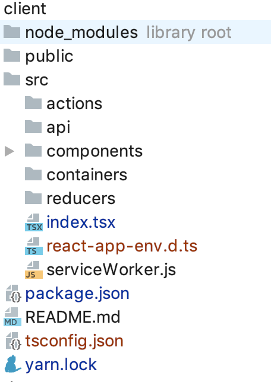

## Instalacja zależności - Quick Start

Część Frontendowa aplikacji będzie stworzona z wykorzystaniem **Create React App**, natomiast backend będzie zamockowany z pomocą **JSON Server**.

Instalujemy globalnie CRA:

`npm i -g create-react-app`

W katalogu głównym tworzymy folder _api_:
 
`mkdir api`

oraz inicjalizujemy CRA:


`create-react-app client`

#### API (JSON Server) ~/api

JSON Server pozwala nam w bardzo szybki i łatwy sposób zamockować api. Dokumentacja: http://jsonplaceholder.typicode.com/

Będąc w katalogu _/api_:

```
npm init
npm i json-server
```

Następnie modyfikujemy _/api/package.json_ i dodajemy:

```json
"scripts": {
"start": "json-server -p 3001 -w db.json"
}
```

Będąc dalej w lokalizacji _/api_  możemy uruchomić api na porcie 3001 komendą:

`npm start`

Dostęp do zmockowanej bazy danych mamy w pliku _/api/db.json_, 
którą możemy dowolnie modyfikować ręcznie:

```json
{
  "posts": [
    {
      "id": 1,
      "title": "json-server",
      "author": "typicode"
    }
  ],
  "comments": [
    {
      "id": 1,
      "body": "some comment",
      "postId": 1
    }
  ],
  "profile": {
    "name": "typicode"
  }
}
```

bądź wysyłając zapytania http na: 

_http://localhost:3001/posts_,
_http://localhost:3001/comments_ etc.

#### Frontend /client

##### Typescript 

Aby **CRA** zaczął współpracować z Typescriptem należy doinstalować:

`yarn add typescript @types/react @types/react-dom `

Od teraz pliki będą mogły mieć rozszerzenia .tsx .ts (oraz wciąż .js).

Następnie usuwamy wszystkie pliki z /src (poza serviceWorker.js), 
a struktura plików będzie się przedstawiała następująco:



Pliki _react-app-env.d.ts_ oraz _tsconfig.json_ dodadzą nam się autmatycznie.

Zawartość pliku _src/index.tsx_ przedstawia się następująco:

```typescript
import React from 'react';
import ReactDOM from 'react-dom';
import App from './components/App';
import * as serviceWorker from './serviceWorker';

ReactDOM.render(<App />, document.getElementById('root'));

serviceWorker.unregister();
```

_src/components/App.tsx_:

```typescript jsx
import React, { Component } from 'react';

class App extends Component {
  render() {
    return (
      <div className="App">
        App
      </div>
    );
  }
}

export default App;
```

Bardzo dobre wprowadzenie na temat typów w Reacie, można przeczytać pod linkiem:
https://github.com/Microsoft/TypeScript-React-Starter#typescript-react-starter

##### Style

Skorzystamy z Biblioteki Semantic UI
Dodajemy w _index.html_:
```html
<link
  rel="stylesheet"
  type="text/css"
  href="https://cdnjs.cloudflare.com/ajax/libs/semantic-ui/2.4.1/semantic.min.css"
/>
```
